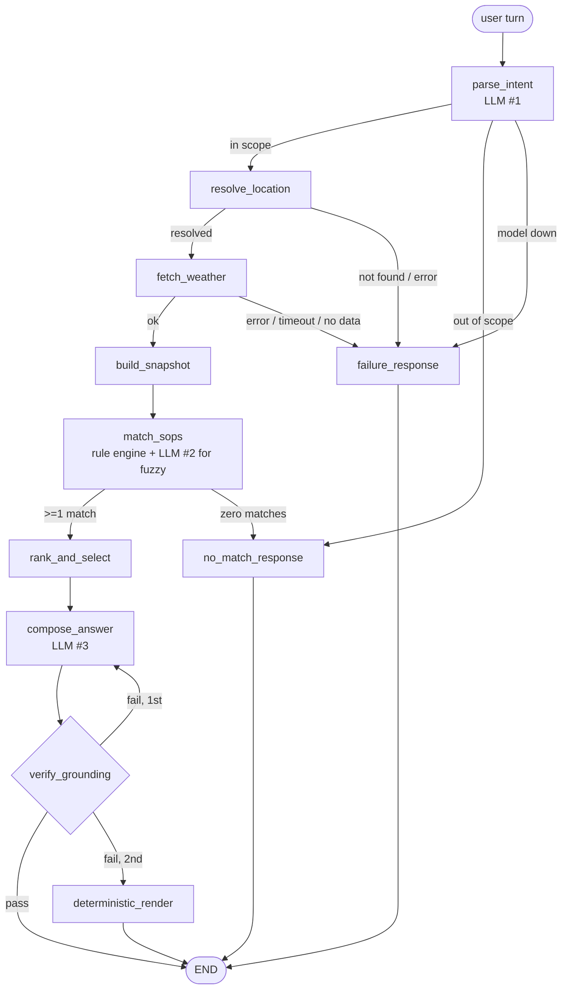

# The LangGraph implementation

How the graph is built, why it is shaped this way, and what each piece is for.
Code: [`app/graph/`](app/graph/) — [`state.py`](app/graph/state.py) (74 lines),
[`nodes.py`](app/graph/nodes.py) (329), [`build.py`](app/graph/build.py) (104).

**Shape:** 11 nodes · 5 conditional edges · 4 terminal paths · 1 cycle.

---

## 1. The graph

Rendered by `python -m app.graph.build --mermaid`, straight off the compiled object, so it
cannot drift from the code.



| Node | Deterministic? | Does |
|---|---|---|
| `parse_intent` | **LLM** | question → `{location, activity, time_window, is_followup, in_scope}` |
| `resolve_location` | code | Open-Meteo geocoding; first candidate |
| `fetch_weather` | code | forecast fetch; raw payload only, no interpretation |
| `build_snapshot` | code | typed fact snapshot + derived fields |
| `match_sops` | code **+ LLM** | rule engine; the model only evaluates `semantic:` conditions |
| `rank_and_select` | code | override → severity → specificity → id |
| `compose_answer` | **LLM** | re-words the selected policy |
| `verify_grounding` | code | the guard; can discard the model's output |
| `deterministic_render` | code | policy text + snapshot, no model |
| `no_match_response` | code | one of three fixed templates, chosen by how it arrived |
| `failure_response` | code | fixed template, no weather figures possible |

---

## 2. State: channels, not a blob

[`state.py`](app/graph/state.py) declares `AdvisoryState` as a `TypedDict`. Each key is an
independent **channel**. Nodes never mutate state — they return a *partial dict* and
LangGraph merges it:

```python
def resolve_location(state) -> dict:
    return {"location": resolved, "trace": ["resolve_location"]}
```

How a channel merges is set by its **reducer**. Default is overwrite; annotate to change
it:

```python
messages: Annotated[list[AnyMessage], add_messages]   # appends
trace:    Annotated[list[str], trace_reducer]          # appends, with a per-turn reset
```

The channels are split three ways, and the split is the design:

```python
# persists across turns
messages, last_location, last_activity

# per-turn scratch
intent, location, raw_payload, snapshot, matched,
selected, secondary, draft, grounding, compose_attempts, failure

# output
final, citations, no_guidance, failed, trace
```

**The snapshot is deliberately not carried forward.** Intent persists so a follow-up need
not repeat itself; facts do not, so turn three can never answer with turn one's numbers.

### `trace_reducer` — why a custom one

State survives across turns, so a plain append would make `trace` grow for the life of the
session and stop describing *this* question. `parse_intent` emits a `__reset__` sentinel as
the first element and the reducer clears on it:

```python
def trace_reducer(left, right):
    if right and right[0] == TRACE_RESET:
        return right[1:]
    return (left or []) + right
```

### `_fresh_turn()` — the trap in checkpointed state

Because state persists, a `failure` left over from turn one would route turn two straight
to the error path. `parse_intent` explicitly nulls every scratch channel at the top of each
turn. This was a real bug before it was a guard.

---

## 3. Edges and routing

```python
g.add_edge("build_snapshot", "match_sops")                 # unconditional

g.add_conditional_edges("fetch_weather", route_after_weather,
                        {"ok": "build_snapshot", "fail": "failure_response"})
```

A conditional edge takes a **router**: it receives the merged state, returns a string key,
and the mapping turns that key into the next node.

```python
def route_after_weather(state) -> str:
    return "fail" if state.get("failure") else "ok"
```

**No router calls the model.** All five sit below the `# routers` divider in
[`nodes.py`](app/graph/nodes.py), and all three LLM call sites are above it. The model
fills in intent and writes prose; it never decides control flow. Checkable in one line:

```bash
awk '/--- routers/,0' app/graph/nodes.py | grep -c 'structured(\|text(\|judge('   # 0
```

The five branch points:

| At | Outcomes |
|---|---|
| `parse_intent` | in scope · out of scope · model unavailable |
| `resolve_location` | resolved · not found |
| `fetch_weather` | ok · unavailable |
| `match_sops` | matched · none |
| `verify_grounding` | pass · retry · fall back |

`parse_intent` exiting straight to `no_match_response` means an out-of-scope question never
spends a geocoding or weather call, and keeps the "no guidance" path visibly distinct from
"couldn't get data" in the trace.

That node is reached two ways, and the difference matters to the user. Arriving from
`parse_intent` means the question was outside what we cover at all. Arriving from
`match_sops` means we resolved the place, fetched the forecast, and *our own policy set*
had nothing to say about it. Both used to share one message, which told a picnic question
that we only cover "cycling, running, commuting" -- while `SOP-LP-001` lists `picnic` in
its own `applies_to`. Disclaiming coverage we have reads as a scope problem when it is a
policy-set problem, so the node now picks its wording from `state["snapshot"]`: present
means we looked and found nothing, absent means we never looked.

---

## 4. The cycle

```python
g.add_conditional_edges("verify_grounding", route_after_verify,
                        {"pass": END, "retry": "compose_answer",
                         "fallback": "deterministic_render"})
```

`compose_answer → verify_grounding → compose_answer` is a loop, and it's the clearest
evidence this is a graph rather than a chain with extra steps: *redo that step under a
stricter prompt, and if it fails again leave by a different exit entirely.*

Termination has two layers — `compose_attempts` in state (domain), and LangGraph's
`recursion_limit` (framework backstop).

The retry matters because rejection is common enough to design for: the guard rejects any
reply containing a figure absent from the snapshot. Second failure drops to
`deterministic_render`, which emits the policy text with a template-substituted fact block
and no model at all. **That path is exercised regularly** — when the API quota is
exhausted, every answer comes out of it, still grounded and still cited.

---

## 5. Execution

LangGraph runs a Pregel-style super-step loop:

1. Load prior state for this `thread_id` from the checkpointer
2. Merge the incoming input (`{"messages": [HumanMessage(...)]}`)
3. Run the entry node → merge its returned dict through the reducers
4. Evaluate the outgoing edge → next node
5. Repeat until a node routes to `END`

Control flow is re-decided after every node from freshly merged state; nothing is planned
ahead.

---

## 6. Session memory

```python
GRAPH = g.compile(checkpointer=MemorySaver(serde=...))
graph.invoke({"messages": [...]}, config={"configurable": {"thread_id": session_id}})
```

After each super-step LangGraph serialises state under `thread_id`; the next `invoke` with
the same id loads it before merging new input. **No memory code was written** — `messages`
accumulates via its reducer and the `last_*` channels persist as ordinary state.

```
turn 1  "is it safe to cycle in Wellington this afternoon?"  → Wellington, cycling
turn 2  "what about this evening instead?"                   → inherits both, re-fetches
```

`MemorySaver` is in-process, so memory dies on restart and threads cannot see each other —
which is exactly the spec. `SqliteSaver` would make it durable in one line.

### Serde

```python
CHECKPOINT_TYPES = [ResolvedLocation, WeatherSnapshot, SOP, MatchedSOP]
MemorySaver(serde=JsonPlusSerializer(allowed_msgpack_modules=CHECKPOINT_TYPES))
```

State carries rich objects. LangGraph's default accepts any type but warns, and a future
version will refuse. Naming the four keeps it working when that flips, and is the *tighter*
setting — deserialisation is restricted to exactly these types.

---

## 7. Where the model is allowed to act

Three calls per question, each bounded:

| # | Node | Constraint |
|---|---|---|
| 1 | `parse_intent` | pydantic `response_schema` — the form has no field in which to express an opinion about safety |
| 2 | `match_sops` (fuzzy only) | returns `{matches: bool, reason: str}` and nothing else |
| 3 | `compose_answer` | receives pre-rendered fact *strings*, never raw JSON; output must pass the guard |

Calls 1 and 2 run on a small model (constrained classification); only call 3 produces text
a user reads. Everything else in the graph is deterministic Python.

---

## 8. Why a graph rather than a chain

Three answers, each pointing at code:

1. **Failure is a visible edge, not a buried `try/except`.** `resolve_location` and
   `fetch_weather` both route to `failure_response`; you can see the honest-failure path in
   the topology.
2. **The retry cycle cannot be expressed linearly.**
3. **Five branch points, four exits.** `parse_intent` alone has three outcomes.

A fourth, practical one: because nodes are thin adapters over layers that don't import the
graph, the weather layer, rule engine and grounding guard were each built and tested
**before the graph existed**.

---

## 9. Reading the trace

Every reply carries the path it took, which is how "why did it say that" gets answered:

```
parse_intent → resolve_location → fetch_weather → build_snapshot
→ match_sops(2 matched) → rank_and_select(SOP-TR-002)
→ compose_answer(attempt 1) → verify_grounding(pass)
```

Recognisable shapes:

| Trace ends with | Means |
|---|---|
| `verify_grounding(pass)` | composed answer, grounding verified |
| `… → deterministic_render` | model unavailable or twice rejected; policy rendered directly |
| `parse_intent → no_match_response` | out of scope — no weather call was made |
| `… fetch_weather(failed) → failure_response` | no data; nothing invented |
| `verify_grounding(REJECTED: …)` | the guard caught a figure not in the snapshot |
