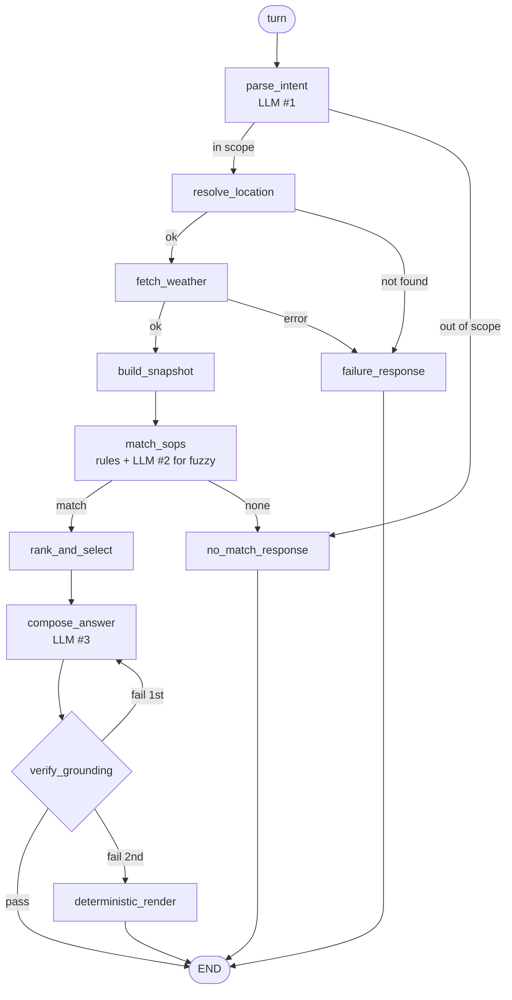

# Weather-Advisory Support Bot

Answers outdoor-activity safety questions ("is it safe to bike to work in Bhopal today?")
from live weather — where **every piece of advice comes from a written policy, never from
the model's judgement**.

> The weather API produces a typed **fact snapshot**; a data-driven **rule engine** picks
> which policies match it; the model only **re-words** the matched policy; and a
> deterministic **guard** discards the reply if it contains a number that isn't in the
> snapshot.

| Deliverable | Where |
|---|---|
| Setup + run, backend and frontend | [Quick start](#quick-start) |
| SOPs, and why this form | [`app/sops/policies/`](app/sops/policies/) · [why](#the-sops) |
| LangGraph implementation | [`app/graph/`](app/graph/) · **[LANGGRAPH.md](LANGGRAPH.md)** |
| Eval suite + results | [`evals/`](evals/) · **[EVAL_RESULTS.md](EVAL_RESULTS.md)** |
| Honest notes on failures | [What the suite missed](#what-the-suite-missed) · [Known gaps](#known-gaps) |

**State:** 13 policies · 17 eval cases · last run **16 passed, 0 failed, 1 skipped**.

---

## Quick start

Python 3.11+.

```bash
python -m venv .venv && .venv\Scripts\activate    # Windows
pip install -r requirements.txt
copy .env.example .env                            # then add GOOGLE_API_KEY
uvicorn server.main:app --reload
```

Open **http://localhost:8000**.

**Backend** — FastAPI on 8000. `GET /` serves the UI · `POST /chat` takes
`{session_id, message}` and returns `{reply, citations, no_guidance, failed, trace}` ·
`GET /policies` lists the loaded rules.

**Frontend** — [`server/static/index.html`](server/static/index.html). One file, vanilla
JS, no build step; FastAPI serves it, so there's no second process and no CORS. It puts a
session id in `sessionStorage` which becomes the graph's `thread_id`, so a refresh starts
a new session — matching "memory resets between sessions".

**Evals** — `python evals/run_evals.py`. Three cases are offline and need no API key.

---

## The SOPs

**Form: one YAML file per policy in [`app/sops/policies/`](app/sops/policies/), found by
glob at startup.** *Why:* YAML is reviewable by someone who doesn't read Python, one file
per rule means two people can edit two policies without conflict, and glob discovery makes
adding a rule the same thing as adding a file.

| ID | Category | Severity | Fires when |
|---|---|---|---|
| `SOP-SYS-001` | situational_override | danger | Heavy-rain system active — **overrides everything** |
| `SOP-TR-002` | travel_commute | danger | Thunderstorm in the asked-about window |
| `SOP-TR-003` | travel_commute | danger | Rain onto ground at or below freezing — ice |
| `SOP-EX-002` | outdoor_exercise | warning | Apparent temp ≥ 38 °C, or ≥ 33 °C with humidity ≥ 75% |
| `SOP-EX-003` | outdoor_exercise | warning | Gusts ≥ 20 km/h above the prevailing wind, on two wheels |
| `SOP-VG-001` | vulnerable_groups | warning | Child outdoors, UV ≥ 7 or apparent temp ≥ 35 |
| `SOP-EX-001` | outdoor_exercise | caution | UV ≥ 6 during a sustained activity |
| `SOP-VG-002` | vulnerable_groups | caution | Older adult, apparent temp ≤ 5, or ≤ 12 with wind ≥ 30 |
| `SOP-VG-003` | vulnerable_groups | caution | Dog walk, temp ≥ 32 with clear sky — pavement burns |
| `SOP-TR-004` | travel_commute | warning | Visibility ≤ 2 km — short sight lines, whatever the cause |
| `SOP-TR-001` | travel_commute | advisory | Rain ≥ 4 mm with visibility ≤ 5 km |
| `SOP-LP-001` | leisure_planning | advisory | **Fuzzy** — a relaxed outing is a poor bet |
| `SOP-GEN-001` | general_conditions | info | Nothing notable — all-clear (`only_if_alone`) |

**Every one of the 13 carries its own `rationale` field** explaining why that threshold,
on that variable, at that severity — so the reasoning sits next to the rule rather than in
a document that can drift from it. The four highlighted below are the ones whose reasoning
generalises; the rest explain themselves in their files.

### The situational override

Open-Meteo doesn't publish "a low-pressure system exists", so `SOP-SYS-001` matches its
**observable signature**, using the IMD's published 24h rainfall classes:

```yaml
match:
  any:
    - {field: rain_class_rank, op: gte, value: 4}      # IMD "heavy" (≥64.5 mm) or worse
    - all:                                              # or substantial rain
        - {field: rain_24h_mm, op: gte, value: 35}      # arriving with
        - {field: gust_peak_24h_kmh, op: gte, value: 45}  # squally gusts
override: true
```

The second branch is the point: it catches the case where no single reading looks extreme
but the situation is. **Aggregation lives in code so a policy can name a _regime_ rather
than a reading** — `build_snapshot` derives `rain_class`, `heavy_rain_regime` and friends,
and the rule refers to them. No event, city or date is hardcoded anywhere.

### Three more that key on the causal variable

The obvious threshold is often a proxy for the hazard rather than its cause. These three
were rewritten to test the cause instead:

- **`SOP-EX-003` — gust differential, not wind speed.** A steady 45 km/h headwind is
  predictable; 20 km/h gusting to 55 is what puts a rider across a lane.
- **`SOP-TR-001` — rainfall intensity, not probability.** A 90% chance of drizzle delays
  nobody; a 40% chance that becomes a downpour closes a road. Short sight lines are a
  separate hazard with their own rule, since fog needs different advice from rain.
- **`SOP-EX-001` — UV dose, with no clock condition at all.** "Is it 11am–4pm" is a proxy
  for "is the sun strong". The snapshot already computes UV for the window asked about, so
  the rule tests that directly and stays quiet at 19:00 on its own.

### The fuzzy rule

"Is today good for a picnic" has no threshold, so `SOP-LP-001` states its condition in
prose and a **single generic judge** ([`llm/semantic.py`](app/llm/semantic.py)) evaluates
it — so a new fuzzy rule is still just a YAML file. Three things keep it honest: the judge
returns **only a boolean** (the advice text is entirely the policy's), it **fails closed**
when the model is unreachable, and a deterministic `comfort_index ≤ 35` backstop still
catches a clearly miserable day.

### Adding a policy without touching code

Drop a `.yaml` into `app/sops/policies/` and restart. That's it — rehearsed, and it
changed **zero files outside that directory**.

It works because the snapshot exposes a fixed vocabulary, documented in
[`app/vocabulary.py`](app/vocabulary.py), which is the only file a policy author needs.
**Field names are validated at load**, because a typo would otherwise produce a rule that
loads cleanly and never fires:

```
unknown snapshot field 'temperature_celsius'. A rule referring to a field that does
not exist would never fire. Did you mean: temperature_c, apparent_temperature_c?
```

---

## Architecture

**5 conditional edges, 4 terminal nodes, 1 cycle.** Emitted by
`python -m app.graph.build --mermaid`, so it can't drift from the code.



The **cycle** is what a chain cannot express: retry under a stricter prompt, and on a
second failure leave by a different exit. Termination is bounded by `compose_attempts` in
state.

**[LANGGRAPH.md](LANGGRAPH.md)** covers the implementation in full — state channels and
reducers, routing, the cycle, the checkpointer, and how to read a trace.

### Deterministic code vs. the model

| Decision | Who | Why |
|---|---|---|
| What was asked | **Model** | Language understanding, bounded by a pydantic schema |
| Whether a fuzzy condition holds | **Model** | No threshold exists; bounded to one boolean |
| Wording of the reply | **Model** | Composition only |
| Which branch the graph takes | **Code** | Routers are pure functions — no model call below the `# routers` line in [`nodes.py`](app/graph/nodes.py) |
| What the weather is | **Code** | API → typed snapshot |
| Which policies match | **Code** | DSL over the snapshot |
| Which policy wins | **Code** | Deterministic sort |
| Whether the reply ships | **Code** | Guard can discard the model's output |

Three model calls per question: intent (schema-bound), the fuzzy judge (boolean only), and
compose (sees pre-rendered fact *strings*, never raw JSON).

### Component boundaries

Each seam is placed so the thing on one side is testable without the other:

| Seam | Crosses | Buys |
|---|---|---|
| `weather/` → `sops/` | the snapshot | the engine unit-tests against a hand-written dict |
| `sops/` → `llm/` | an injected callable | [`engine.py`](app/sops/engine.py) has **no LLM import**; 11 of 12 rules match offline |
| everything → `graph/` | thin node adapters | nodes marshal state, hold no domain logic |
| model → user | the guard | [`grounding.py`](app/guards/grounding.py) takes a snapshot and an SOP, nothing else |

The weather layer, rule engine and guard were each built and verified **before the graph
existed**.

### Conflict resolution — chosen deliberately

Sort by **override → severity → specificity → id**. The top policy leads; up to two others
get a sentence; all appear in `citations`.

*Why:* suppressing a second genuine hazard is a safety regression, but five equal warnings
means none gets acted on. One clear instruction, briefly qualified, full set auditable.

One exception: a policy marked `only_if_alone` (the all-clear) is dropped as soon as
anything else matches — it asserts *nothing notable was found*, so beneath a warning it
contradicts itself. That happened for real.

### Session memory

`MemorySaver` keyed on `thread_id`. Carried across turns: messages, `last_location`,
`last_activity`. **Not carried: the weather.**

```
"is it safe to cycle in Wellington this afternoon?"  → resolves Wellington, cycling
"what about this evening instead?"                   → inherits both, re-fetches weather
```

Carrying intent stops the user repeating themselves; carrying *facts* would let turn three
answer with turn one's numbers. Since selection is deterministic in `(snapshot, intent)`,
two turns can only disagree when conditions actually changed.

---

## How the guarantees are enforced

**Cites a policy or says none applies.** `citations` is a first-class response field, not
parsed out of prose. All four terminal nodes set it, or set `no_guidance`/`failed`.

**Never a forecast it doesn't have.** `failure_response` makes no model call and never
reads the snapshot — it cannot contain a forecast. Geocoding empty, geocoding error,
forecast error, timeout, and a 200 with no `current` block all route to it.

**Never invents advice.** `no_match_response` returns a fixed constant.

**Numbers come from the API** — [`app/guards/grounding.py`](app/guards/grounding.py):

```
allow-set = every numeric value in the snapshot + every number in the cited policies
durations stripped first ("over the next 24 hours") — a reading never carries a time unit
pass 1: numbers with a weather unit ("30 km/h", "20 C", "60%") must be in the allow-set
pass 2: everything else must be too, or be a small unit-less count (0–10)
reject → retry once stricter → then render the policy deterministically
```

Also rejects a reply citing a policy id that wasn't selected, which is what stops a user
talking it into confirming a policy that doesn't exist.

**The honest limit:** a cited policy's own thresholds are allowed, so the bot can say "our
guidance applies above 50 km/h". So the defensible claim is slightly narrower than "every
number came from the API":

> **No number in a reply is ever originated by the model.** Each traces to the API
> response for that request, or to a reviewed policy file.

And the guard checks **numbers, not propositions** — "the storm covers only part of today"
contains no figure. Mitigated by making the snapshot rich enough that the model needn't
infer; this is the softest part of the design.

---

## Evals

`python evals/run_evals.py` → [EVAL_RESULTS.md](EVAL_RESULTS.md), which states per case
what is checked, what a pass means, and what happened.

**Live weather doesn't hold still**, so the suite is split:

- **Behavioural cases replay recorded fixtures** — real Open-Meteo responses for real
  places on real dates, provenance stamped, no value edited.
- **Fixtures are chosen by running the real matcher** over candidate days and keeping one
  where the intended policy leads, so a fixture can't quietly stop testing its claim.
- **The live severe case reports SKIPPED, never a vacuous pass.** It cannot be made to
  pass on demand — that's the point. It is skipping now.
- **Invariants that hold in any weather run live**: numbers in reply ⊆ numbers from API,
  cited policy == engine-selected policy, no selection ⟹ the no-guidance phrase.

**Adversarial:** three cases — numeric coercion, fabricated policy, prompt injection. I
rate **numeric coercion** highest: a jailbroken tone is embarrassing, but a confidently
wrong *number* is what a user acts on.

### What the suite missed

Seven defects surfaced while building this. **The suite found one.** The rest came from
probing the guard with a fabricated reply, reading the fallback's real output, asking
ordinary follow-ups in the chat UI, and auditing the policies for pairs that contradict.
All seven are in [EVAL_RESULTS.md](EVAL_RESULTS.md).

The worst — one window's weather leaking into another, giving a danger-severity lightning
warning for a storm-free evening — **the grounding guard could never have caught**: every
figure was real, the storm was real, it belonged to a different part of the day.

A suite tests the failures you already imagined. Every guard here was verified by
reintroducing the defect and watching it fail; twice a verification silently did nothing
and reported a pass.

The last one generalises into a review I'd run on any new policy: **a rule's advice must
be true for every condition that can trigger it.** `SOP-TR-001` fired on low visibility
alone and then told a user "there's enough water coming down" beside a reading of
0.0 mm. Three more `any:` branches had the same shape. No numeric guard catches this —
every figure involved is real.

---

## Known gaps

1. **A policy needing a variable we never request** does need a one-line change to the
   field list in [`openmeteo.py`](app/weather/openmeteo.py). Mitigated by requesting
   generously, but the limit is real.
2. **The fuzzy judge is the one place a model decides rather than composes.** Bounded to a
   boolean with a deterministic backstop; not eliminated.
3. **Geocoding takes the first candidate.** It misfires — live, "Kochi" resolved to Kochi
   **Japan**, "Goa" to **Genoa, Italy**. The resolved name is echoed so it's visible.
4. **`SOP-SYS-001` infers a rain system** from rainfall and gust signatures; it's a proxy
   for an IMD bulletin, not ground truth.
5. **Free-tier quota is per model per day.** The app splits across two models and fails
   fast on daily caps, but two things using the bot at once will trip the per-minute limit
   and drop replies to the plainer deterministic path.

---

## Layout

```
app/
  vocabulary.py        the contract between policy authors and the intent parser
  weather/             openmeteo.py (API) · snapshot.py (the numeric source of truth)
  sops/                policies/*.yaml · schema.py · loader.py · engine.py (no LLM import)
  llm/                 client.py (provider swap surface) · semantic.py · prompts/*.md
  guards/grounding.py  numeric grounding enforcement
  graph/               state.py · nodes.py · build.py
server/                main.py (FastAPI) · static/index.html (chat UI)
evals/                 cases.yaml · run_evals.py · record_fixtures.py · fixtures/*.json
```
