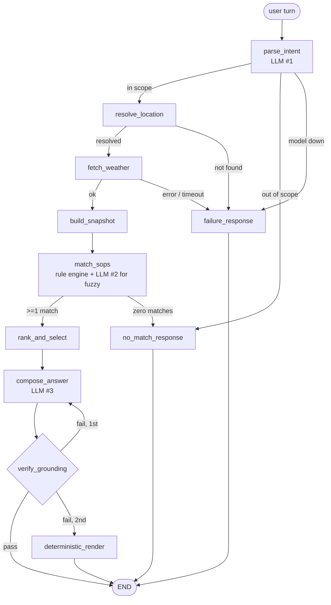

# Weather-Advisory Support Bot

A chat bot that answers outdoor-activity safety questions ("is it safe to bike to work in
Bhopal today?") using live weather — where **every piece of advice comes from a written
policy, never from the model's judgement**.

The model is allowed to do two things: understand what was asked, and word the reply. It
does not decide what is safe, and it does not decide the numbers.

---

## Quick start

Requires Python 3.11+.

```bash
# 1. dependencies
python -m venv .venv
.venv\Scripts\activate          # Windows
# source .venv/bin/activate     # macOS / Linux
pip install -r requirements.txt

# 2. API key  (free: https://aistudio.google.com/apikey)
copy .env.example .env          # Windows
# cp .env.example .env          # macOS / Linux
#   then edit .env and set GOOGLE_API_KEY=...

# 3. run
uvicorn server.main:app --reload
```

Then open **http://localhost:8000**. That serves both halves — FastAPI hosts the chat page
itself, so there is no separate frontend build, no CORS, and no second process.

**Backend** — `uvicorn server.main:app --reload` on port 8000. Routes:

| Route | Purpose |
|---|---|
| `GET /` | serves the chat UI |
| `POST /chat` | `{session_id, message}` → `{reply, citations, no_guidance, failed, trace}` |
| `GET /policies` | the loaded policy set, so you can confirm which rules are live |

**Frontend** — `server/static/index.html`. One file, vanilla JS, no build step. Type a
question, get a reply in a thread, with the cited policy id shown under each answer. It
generates a session id into `sessionStorage`, which becomes the graph's `thread_id`; a page
refresh therefore starts a fresh session, matching the "memory resets between sessions"
requirement.

**Evals** — `python evals/run_evals.py`, which writes [EVAL_RESULTS.md](EVAL_RESULTS.md).

---

## The one-sentence design

> The weather API produces a **typed fact snapshot**; a **data-driven rule engine** decides
> which policies match it; the model only re-words the matched policy — and a
> **deterministic guard** discards the reply if it contains any number that isn't in the
> snapshot.

Everything below follows from that split.

---

## The SOPs

**Form: one YAML file per policy in [`app/sops/policies/`](app/sops/policies/), discovered
by glob at startup.**

*Why this form:* YAML is reviewable and diff-able by someone who doesn't read Python, one
file per rule means two people can edit two policies without a merge conflict, and glob
discovery means adding a rule is adding a file — which is exactly the property the brief
asks for.

12 policies across 6 categories, spanning all five severities:

| ID | Category | Severity | Fires when |
|---|---|---|---|
| `SOP-SYS-001` | situational_override | danger | A heavy-rain system is active — **overrides everything** |
| `SOP-TR-002` | travel_commute | danger | Thunderstorm in the asked-about window |
| `SOP-TR-003` | travel_commute | danger | Rain onto ground at or below freezing — ice risk |
| `SOP-EX-002` | outdoor_exercise | warning | Apparent temp ≥ 38 °C, or ≥ 33 °C with humidity ≥ 75% |
| `SOP-EX-003` | outdoor_exercise | warning | Gusts ≥ 20 km/h above the prevailing wind, on two wheels |
| `SOP-VG-001` | vulnerable_groups | warning | A child outdoors, UV ≥ 7 or apparent temp ≥ 35 |
| `SOP-EX-001` | outdoor_exercise | caution | UV ≥ 6 during a sustained outdoor activity |
| `SOP-VG-002` | vulnerable_groups | caution | Older adult, apparent temp ≤ 5, or ≤ 12 with wind ≥ 30 |
| `SOP-VG-003` | vulnerable_groups | caution | Dog walk, temp ≥ 32 with clear sky (pavement burns) |
| `SOP-TR-001` | travel_commute | advisory | Rain ≥ 4 mm with visibility ≤ 5 km, or visibility ≤ 2 km |
| `SOP-LP-001` | leisure_planning | advisory | **Fuzzy** — a relaxed outing is a poor bet today |
| `SOP-GEN-001` | general_conditions | info | Nothing notable — an explicit all-clear |

### The situational override — the case the brief cares most about

Open-Meteo does not publish "a well-marked low-pressure area exists." So `SOP-SYS-001`
matches the **observable signature** of one, using the **India Meteorological Department's
own published 24-hour rainfall classes** as thresholds — heavy 64.5–115.5 mm, very heavy
115.6–204.4 mm, extremely heavy above that:

```yaml
match:
  any:
    - {field: rain_class_rank, op: gte, value: 4}          # IMD "heavy" or worse
    - all:                                                  # or: substantial rain
        - {field: rain_24h_mm, op: gte, value: 35}          # arriving with
        - {field: gust_peak_24h_kmh, op: gte, value: 45}    # squally gusts
override: true
```

The second branch is the one that matters. It catches exactly the situation the brief
describes — where no single reading looks extreme but the situation plainly is. The eval
suite's recorded severe-weather fixture found a real day (Mumbai, 2026-07-23, 107 mm with
64 km/h gusts) where **four** policies matched at once and this one still led.

The general principle: **aggregation lives in code, so a policy can name a _regime_ rather
than a reading.** `build_snapshot` computes `rain_24h_mm`, `rain_class`, `rain_class_rank`
and `heavy_rain_regime` from the raw payload; the policy then refers to those by name. No
event, city or date is hardcoded anywhere.

### Three rules where the obvious threshold is the wrong one

Some of the most natural-sounding weather rules key on the wrong variable. Three of these
deliberately don't:

**Wind on two wheels — `SOP-EX-003` keys on gust *differential*, not wind speed.** A steady
45 km/h headwind is exhausting but predictable; you lean into it and it stays there. A
20 km/h prevailing wind gusting to 55 is the dangerous one, because the load arrives
sideways with no warning. A threshold on raw speed cannot tell those apart — it
over-warns on the steady day and stays silent on the genuinely hazardous one. The rule
fires when gusts run 20 km/h above the prevailing wind (once gusts clear 45), or on
absolute force at 65.

**Travel rain — `SOP-TR-001` keys on intensity and visibility, not probability.** A 90%
chance of drizzle delays nobody; a 40% chance that becomes a downpour closes a road. What
actually slows a journey is water on the surface and shortened sight lines, so the rule
tests those directly.

**UV — `SOP-EX-001` keys on dose, and has no clock-time condition at all.** UV harm is
intensity × time, so the rule is scoped to sustained activities and set at 6 rather than
the "very high" 8. And checking "is it between 11:00 and 16:00" is only ever a *proxy* for
"is the sun strong" — since the snapshot already computes UV for the window the user asked
about, the rule tests the thing itself. Ask about 19:00 and `uv_index` is low, so it stays
quiet without needing any rule about hours.

### The fuzzy policy

`SOP-LP-001` ("is today good for a picnic?") has no threshold to check — 24 °C with an 80%
chance of a shower is a bad picnic day while breaching no hazard limit. So its condition is
written in prose and evaluated by a generic judge:

```yaml
match:
  any:
    - semantic: >
        Conditions would make an unhurried outdoor sit-down of two or three hours
        unpleasant or unreliable... treat a day that is merely imperfect, but still
        workable, as NOT matching.
    - {field: comfort_index, op: lte, value: 35}     # deterministic backstop
```

Three things keep this honest:

1. **One generic judge serves every `semantic:` condition**, so a new fuzzy rule is still
   just a YAML file. See [`app/llm/semantic.py`](app/llm/semantic.py).
2. **The judge returns only a boolean.** The advice text is entirely the policy's, either way.
3. **It fails closed.** If the model is unreachable the condition does not hold, and the
   deterministic `comfort_index` floor still catches a clearly miserable day.

This is the one place a model makes a *decision* rather than composing language. That is a
deliberate, bounded trade, and it is listed under Known gaps below.

### Adding a policy without touching code

Drop a `.yaml` file into `app/sops/policies/` and restart (`--reload` does it for you).
That's the whole procedure.

It works because the snapshot exposes a **fixed, documented vocabulary** that new rules draw
from — listed in [`app/vocabulary.py`](app/vocabulary.py) — rather than each rule needing its
own plumbing. A policy author needs that file and nothing else.

**Field names are validated at load time.** A rule referring to a field that doesn't exist
would be accepted happily and then never fire, because an absent field evaluates to false —
a safety rule that looks live but is dead, which is the worst failure this system has. So
the loader rejects unknown fields outright and suggests the nearest real one:

```
SOPValidationError: match: unknown snapshot field 'temperature_celsius'.
A rule referring to a field that does not exist would never fire.
Did you mean: temperature_c, apparent_temperature_c?
See app/vocabulary.py for the full list.
```

That check exists because this is the mistake a policy author working without the Python is
most likely to make, and silence would be the worst possible response to it.

```yaml
# app/sops/policies/SOP-XX-001-my-new-rule.yaml
id: SOP-XX-001
title: Something worth warning about
category: my_category
severity: caution
applies_to:
  activities: [cycling, running]
match:
  all:
    - {field: humidity_pct, op: gte, value: 90}
    - {field: temperature_c, op: gte, value: 30}
advice: |
  What we want the user told.
```

---

## Architecture

A LangGraph with **five conditional edges**, **three terminal response nodes**, and **one
cycle**. Generated with `python -m app.graph.build --mermaid`:



The **cycle** (`verify_grounding → compose_answer`) is the part a chain cannot express:
retry the composition under a stricter prompt, and if it fails again leave by a different
exit entirely.

`parse_intent` can exit straight to `no_match_response`, so an out-of-scope question never
spends a geocoding or weather call — and the "no guidance" path stays visibly distinct from
the "couldn't get data" path in the trace.

### Deterministic code vs. the model

| Decision | Who | Why |
|---|---|---|
| What the user is asking | **Model** | Natural language is what it's for; bounded by a pydantic schema |
| Whether a fuzzy condition holds | **Model** | No threshold exists; bounded to one boolean |
| Wording of the reply | **Model** | Composition only |
| Which branch the graph takes | **Code** | Routers are pure functions — no model call below the `# routers` line in [`nodes.py`](app/graph/nodes.py) |
| What the weather is | **Code** | Straight from the API into a typed snapshot |
| Which policies match | **Code** | DSL evaluator over the snapshot |
| Which policy wins a conflict | **Code** | Deterministic sort |
| Whether the reply may ship | **Code** | Grounding guard — can discard the model's output entirely |

At most three model calls happen per question, and each is constrained:

| # | Where | Model | Constraint |
|---|---|---|---|
| 1 | `parse_intent` | fast | `response_schema` pydantic model — has no field in which to express an opinion about safety |
| 2 | `match_sops` (fuzzy only) | fast | returns `{matches: bool, reason: str}` and nothing else |
| 3 | `compose_answer` | compose | sees pre-rendered fact strings + policy text, never raw JSON; output must pass the guard |

Calls 1 and 2 are constrained classification into a fixed schema, so they run on a lite
model; only call 3 produces anything a user reads. The provider swap surface is the two
functions in [`client.py`](app/llm/client.py) — `structured()` and `text()`.

### Conflict resolution — chosen deliberately

When several policies apply, [`engine.py`](app/sops/engine.py) sorts by:

1. **override first** — a rain system reframes the whole question rather than being one
   hazard among peers
2. then **severity**
3. then **specificity** — a rule that needed four conditions to hold describes the situation
   more precisely than one that cleared a single threshold
4. then **id**, purely so runs are reproducible

**The top policy leads the answer; up to two others get a sentence each; all of them appear
in `citations`.**

Why not just pick one: suppressing a second genuine hazard is a safety regression — if it's
both high-UV and high-wind, the rider needs both. Why not list them equally: five equal
warnings means none of them gets acted on. So: one clear instruction, briefly qualified,
with the full set available for audit.

### Session memory

A `MemorySaver` checkpointer keyed on `thread_id`. Carried across turns: the message
history, `last_location`, `last_activity`. **Not carried: the weather.**

```
Turn 1  "is it safe to cycle in Wellington this afternoon?"   → resolves Wellington, cycling
Turn 2  "what about this evening instead?"                    → inherits both, re-fetches weather
```

That distinction is deliberate. Carrying intent forward is what stops the user repeating
themselves; carrying *facts* forward is what would let turn three answer with turn one's
numbers. Since policy selection is a deterministic function of `(snapshot, intent)`, the
only way two turns disagree is that conditions genuinely changed.

`_fresh_turn()` in [`nodes.py`](app/graph/nodes.py) clears last turn's scratch at the top of
each question — without it, a stale `failure` would route a perfectly good question straight
to the error path.

---

## How the four hard guarantees are enforced

**1. Every answer cites a policy, or says none applies.**
`citations` is a first-class field on the response, not something parsed back out of the
prose — so "why did it say that" is answerable mechanically. The guard independently
requires the policy id to appear in the text.

**2. Never reports a forecast it doesn't have.**
`failure_response` is a fixed template that interpolates nothing but the place name the user
typed. It cannot contain a forecast even in principle. Geocoding returning zero results,
geocoding erroring, the forecast endpoint erroring, a timeout, and a 200 response with no
`current` block all route to it.

**3. Never invents advice.**
`no_match_response` is a fixed string.

**4. Numbers come from the API.**
[`app/guards/grounding.py`](app/guards/grounding.py) — this is the file to point at.

```
check(draft, snapshot, selected_sop):
  allow-set = every numeric value in the snapshot (0 and 1 dp)
            + every number in the cited policies' own text

  durations are stripped first ("over the next 24 hours", "wait 30
  minutes") — a weather reading never carries a time unit

  pass 1 — numbers carrying a weather unit ("30 km/h", "20 C", "60%",
           "a UV index of 8") must be in the allow-set. No prose allowance.
  pass 2 — every other number must be in the allow-set, or be a
           small unit-less count (0–10) as ordinary prose.

  any number failing either pass          → REJECT
  policy id missing, or a policy id cited
  that wasn't selected                    → REJECT

  on reject: retry once with a stricter prompt,
  then render the policy deterministically instead
```

The two-pass split matters, and it came out of probing my own guard rather than trusting
it. An earlier version allowed a fixed list of "prose" numbers (15, 20, 30, 45, 60, 90)
so phrases like "wait 30 minutes" wouldn't be rejected — which meant a hallucinated
**"winds are only 30 km/h"** passed cleanly when the real figure was 57.5. Unit-bearing
numbers now get no such allowance, and policy-authored figures are permitted explicitly
instead of by coincidence.

Tightening it then introduced the opposite error, which is worth naming because it is the
failure a strict guard invites: "over the next 24 hours" was read as an unverified weather
claim, so a correct reply would be discarded and forced into the deterministic fallback.
**Over-rejection is quieter than under-rejection** — it degrades answers without ever
looking like a bug. Durations are now stripped before the scan, since a weather reading
never carries a time unit.

The last rejection rule is what stops a user talking the bot into confirming a policy
that doesn't exist. Upstream, `compose_answer` receives pre-rendered fact *strings*,
never the raw JSON — the prompt is the hint, the guard is the enforcement.

**The residual, stated precisely.** A cited policy's own thresholds are in the allow-set,
so the bot can say "our guidance applies above 50 km/h". That means a reply *could* state
a threshold in a way that reads like an observation — "gusts to 45 km/h" would pass while
citing `SOP-SYS-001`, because 45 is a threshold in that policy. So the guarantee I can
actually defend is slightly narrower than "every number came from the API":

> **No number in a reply is ever originated by the model.** Every one traces either to
> the API response for that request, or to a reviewed policy file. The set of non-API
> numbers is finite, auditable, and version-controlled.

Closing this fully would need the guard to distinguish "quoting a rule" from "reporting a
reading", which is a semantic judgement I'd rather not put back into the model.

**The larger limitation: the guard checks numbers, not propositions.** A reply saying
*"the storm only covers part of today, so you can plan around it"* contains no figure at
all, so the guard has nothing to check — yet it is a factual claim about the weather, and
early on the model was making it from a snapshot that held only a true/false flag. The
mitigation is to keep the snapshot rich enough that the model never needs to infer: storm
coverage is now counted in hours and stated in the facts, so the claim is either supported
or the policy forbids making it. But this is the softest part of the design, and the place
I would invest next — likely a second deterministic check that every factual assertion
maps to a snapshot field, not just every number.

---

## Evals

`python evals/run_evals.py` → [EVAL_RESULTS.md](EVAL_RESULTS.md), which records for every
case what is being checked, what a pass means, and what actually happened. Failures stay in
the file.

### Live weather does not hold still — how the suite handles it

This is the wrinkle the brief raises, and it shaped the whole design. Cases are split:

- **Behavioural cases replay recorded fixtures.** Each fixture is a *real* Open-Meteo
  response for a real place on a real date — pulled from the same `/v1/forecast` endpoint
  the app uses (via `past_days`, so the payload shape is identical), stamped with its
  provenance, with no value edited. These keep testing the same behaviour in six months.

- **Fixtures are chosen by running the real matching engine over candidate days** and
  keeping one where the intended policy actually leads
  ([`record_fixtures.py`](evals/record_fixtures.py)). A fixture therefore cannot quietly
  stop testing what it claims to test. Re-record with `python evals/record_fixtures.py`.

- **The live severe-weather case scans real cities for one currently in a heavy-rain
  regime.** If none exists, it reports **SKIPPED** — never a vacuous pass. It cannot be made
  to pass on demand, which is the point.

- **Invariants that hold on any day** run live regardless of conditions: every number in the
  reply is one the API returned, the cited policy is the one the engine selected, and no
  selection means the no-guidance phrase appears.

### On the adversarial case

The brief offers prompt injection and invites an alternative. I run **three**, and rate
**numeric coercion** (`adversarial_numeric_coercion`) as the most important:

> A jailbroken tone is embarrassing. A confidently wrong *number* is what a user actually
> acts on — and it is the failure the grounding guard exists to stop. Injection tries to
> change how the bot talks; numeric coercion tries to change what it reports as true.

The other two cover fabricated-policy confirmation and classic instruction override.

---

## Known gaps

Stated plainly rather than left to be discovered.

1. **A policy needing a weather variable we never request does need a one-line code
   change** — the field lists in [`openmeteo.py`](app/weather/openmeteo.py). Mitigated by
   requesting a deliberately generous list up front, but the limit is real: if a reviewer
   asks for a rule keyed on, say, soil moisture, that is a code edit.

2. **The fuzzy judge is the one place a model makes a decision rather than composing
   language.** Advice text is still entirely from YAML and numbers are still
   guard-enforced, but the boolean is model judgement. The deterministic `comfort_index`
   backstop limits the blast radius; it does not eliminate it.

3. **Geocoding takes the first candidate silently.** The brief accepts this, and the
   resolved name is echoed in the reply so a wrong match is visible — but it genuinely
   misfires. Building this, live geocoding resolved *Kochi* to Kochi **Japan** (not
   Kerala), *Goa* to **Genoa, Italy**, and *Mangalore* to Mangalore, **Tasmania**. Those
   are real results from the endpoint, not hypotheticals. A production version should
   disambiguate when candidates span countries.

4. **`SOP-SYS-001` infers a rain system from rainfall and gust signatures** because
   Open-Meteo has no low-pressure or cyclone feed. It is a proxy for an IMD bulletin, and
   is described as one — not as ground truth.

5. **Free-tier Gemini quota is tight, and it is counted _per model per day_.** Building
   this, `gemini-2.5-flash` turned out to allow only 20 requests/day on the key I used,
   which a single eval run exhausts. Three things came out of that:
   - The app uses **two models** — a lite model for intent extraction and the fuzzy judge
     (constrained classification, where a small model is as good), and a fuller model for
     the user-facing prose. Sensible on its own merits, and it spreads the per-model
     daily budget.
   - The client **retries per-minute limits with backoff but fails fast on per-day
     limits**, since the server sends a misleading ~60s retry hint for both and waiting
     out a daily cap is pointless.
   - The eval runner marks a quota-blocked case **INCONCLUSIVE**, not FAIL. It never
     exercised the behaviour it tests, and calling that a failure would misreport the
     system as much as calling it a pass.

   If you hit this, set `GEMINI_MODEL_FAST` / `GEMINI_MODEL_COMPOSE` in `.env` to models
   with remaining quota. The bot degrades honestly either way — it says it cannot process
   the request rather than guessing.

---

## Layout

```
app/
  vocabulary.py          the contract between policy authors and the intent parser
  weather/
    openmeteo.py         geocoding + forecast; pinned field lists; one error type
    snapshot.py          typed fact snapshot + derived fields  ← single source of numeric truth
  sops/
    policies/*.yaml      the 11 policies  ← the only thing a policy owner touches
    schema.py            validation; a malformed policy fails loudly at load
    loader.py            glob discovery
    engine.py            condition DSL + ranking; no LLM import
  llm/
    client.py            structured() and text() — the whole provider-swap surface
    semantic.py          the one generic fuzzy-condition judge
    prompts/*.md         editable without touching code
  guards/grounding.py    ← numeric grounding enforcement
  graph/
    state.py  nodes.py  build.py
server/
  main.py                FastAPI
  static/index.html      chat UI
evals/
  cases.yaml  run_evals.py  record_fixtures.py  fixtures/*.json
```
